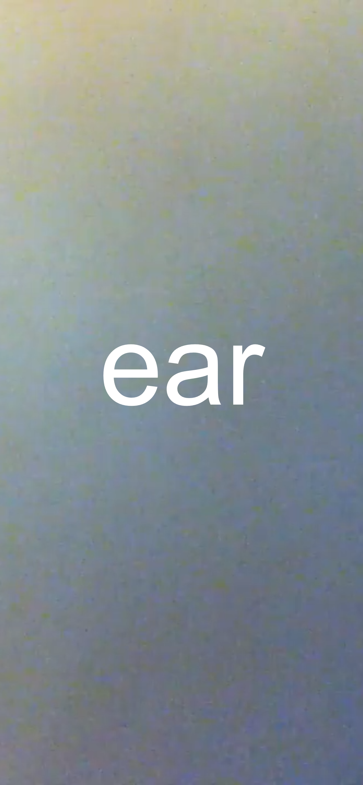
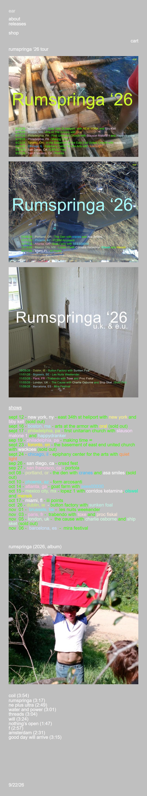
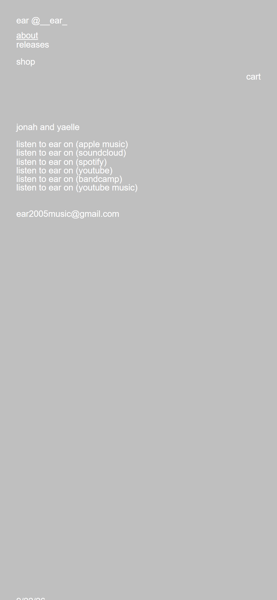
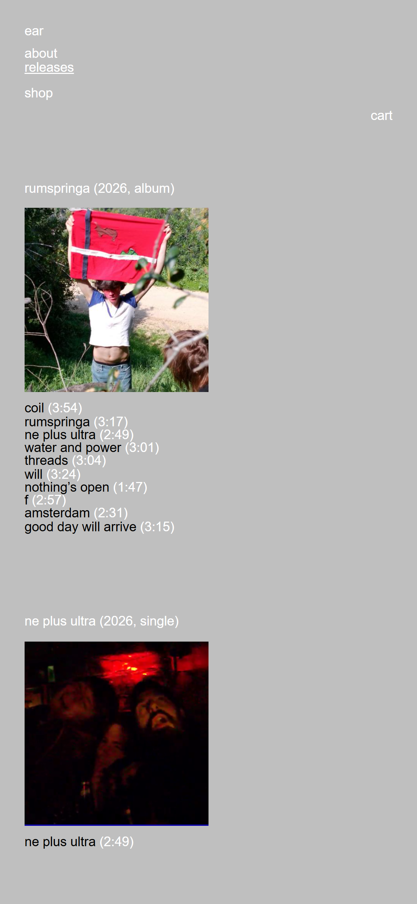

# A — ear-music.org

**What it is.** The artist site for ear (Jonah and Yaelle), a duo on a 2026 album called *Rumspringa*, built on Cargo. It exists to route people outward — to ticket sellers, to streaming platforms, to the shop — and does almost nothing else.

**Who it's for.** Someone who already knows the band and arrived looking for a date, a record, or a link.

Captured 2026-09-22 · 390 × 844, dpr 3.

| page | URL | HTTP | scroll height |
|---|---|---:|---:|
| splash | `https://ear-music.org/` | **200** | 844 |
| index | `https://ear-music.org/home-2` | **200** | 2101 |
| about | `https://ear-music.org/about` | **200** | 875 |
| releases | `https://ear-music.org/releases` | **200** | 1814 |

Those four are the whole site. `shop` and `cart` in the nav leave for B.

---

## Captures

Splash · index (full) · about · releases






Above-the-fold versions sit alongside each: `captures/ear-music/*-fold.png`.

---

## Layout

### `/` — the door

```
390 ×844
┌──────────────────────────────┐
│                              │
│                              │
│                              │   flat #cbbc55 mustard,
│         ear                  │   nothing else on the page
│                              │   wordmark 122px, white,
│                              │   optically centred
│                              │
│                              │
└──────────────────────────────┘
```

One word, one link, one screen. The wordmark sits at x 107 in a 390 box — centred by eye, not by rule. There is no nav, no scroll, no footer. It's a held breath before the site starts.

### `/home-2` — the index

```
390 ×2101
┌──────────────────────────────┐
│ ear                          │  22.9
│ about                        │
│ releases                     │
│                              │  ← blank line
│ shop                         │
│                         cart │  right-aligned
│                              │
│ rumspringa '26 tour          │  section label
│┌────────────────────────────┐│
││                            ││  tour poster 1
││   [image, full width]      ││  344.2 × 265.9
│└────────────────────────────┘│
│┌────────────────────────────┐│
││   [image]                  ││  tour poster 2
│└────────────────────────────┘│
│┌────────────────────────────┐│
││   [image, square]          ││  tour poster 3  344.2²
│└────────────────────────────┘│
│                              │
│ shows                        │  underlined label
│ sept 12 - new york, ny - …   │  ← 18 rows, hand-tinted
│ sept 16 - boston, ma - …     │     one line each
│ …                            │
│                              │
│ rumspringa (2026, album)     │
│┌────────────────────────────┐│
││   [cover, square]          ││  344.2²
│└────────────────────────────┘│
│ coil (3:54)                  │  tracklist, one line each
│ rumspringa (3:17)            │
│ …                            │
│ 9/22/26                      │  live date
└──────────────────────────────┘
```

**Composition.** Everything is left-aligned to a single 22.9px gutter, in one 344.2px column. There is no centring anywhere and no second column. Images interrupt the text column at exactly its width — they never bleed to the edge.

**Air.** Almost none inside blocks, a lot between them. Rows sit 12.2px apart (one line); a paragraph break is 24.5px (two lines). Those are the only two vertical values on the page.

**Nav.** Top-left, stacked one item per line, with a blank line before `shop` — a group separator made of nothing but a skipped line. `cart` breaks the pattern and right-aligns. The nav is not fixed; it scrolls away and never returns. **The current page is marked with an underline** (`about` is underlined on `/about`).

**Footer.** A live date stamp — `9/22/26`, a `<digital-clock>` element. No copyright, no nav, no social. 39px wide.

### `/about` — the real links model

```
┌──────────────────────────────┐
│ ear @__ear_                  │
│ about                        │  ← underlined (current)
│ releases                     │
│ shop                         │
│                         cart │
│                              │
│                              │  ← large deliberate gap
│ jonah and yaelle             │
│                              │
│ listen to ear on (apple music)│
│ listen to ear on (soundcloud) │  6 rows, one line each,
│ listen to ear on (spotify)    │  no dividers, no icons
│ listen to ear on (youtube)    │
│ listen to ear on (bandcamp)   │
│ listen to ear on (youtube music)│
│                              │
│ ear2005music@gmail.com       │
│                              │
│         [ ~500px of nothing ]│
│                              │
│ 9/22/26                      │
└──────────────────────────────┘
```

**This, not `/home-2`, is the page to copy for sie's links page.** Six platform links, each a full sentence in lowercase with the platform in parentheses, stacked one per line with no dividers, no logos and no hover treatment. The page is 875px tall and more than half of it is empty.

---

## Typography

System Helvetica stack, no webfont — see `fonts.md`. One size across the whole site.

| role | example copy | size | weight | line-height |
|---|---|---:|---:|---:|
| wordmark | `ear` | 12.2304px | 400 | 1.0 |
| nav | `about` · `releases` · `shop` · `cart` | 12.2304px | 400 | 1.0 |
| section label | `shows` · `rumspringa '26 tour` | 12.2304px | 400 | 1.0 |
| list row | `sept 12 - new york, ny - east 34th st heliport with new york and bby kell` | 12.2304px | 400 | 1.0 |
| tracklist | `coil (3:54)` | 12.2304px | 400 | 1.0 |
| footer | `9/22/26` | 12.2304px | 400 | 1.0 |
| splash only | `ear` | 122.304px | 400 | 1.0 |

Line-height 1.0 is the signature — text sits in tight bands with no internal air, and every gap is *between* blocks. Lowercase is typed, not CSS (`text-transform: none`).

---

## Colour

| role | value | composited |
|---|---|---|
| page ground | `rgb(191,191,191)` | **#bfbfbf** |
| all default text | `rgb(255,255,255)` | **#ffffff** |
| wordmark | | #ebebeb |
| accent — shows with tickets left | | **#3bfb00** |
| splash ground | | **#cbbc55** |
| dividers | — | **none anywhere** |

White on `#bfbfbf` is **1.84:1** — about 40% of the WCAG AA threshold. It works here because the type is texture rather than reading matter; it would not survive a tracklist you actually need to read.

`#3bfb00` on `#bfbfbf` is **1.31:1**. It reads purely on hue, with essentially zero luminance contrast — a trick that stops working the moment the ground gets lighter.

### The hand-tinted layer

Individual words *inside* the show rows — city names, support acts — are tinted one-off with inline styles. Twenty-eight distinct values across eighteen rows:

```
#d0ffe1  #fcdaff  #ff913d  #fff8fd  #ffc2e3  #caff76  #f5c8ff
#c9ffad  #c2f1ff  #cae4ff  #7aeaf6  #adeaff  #6decf8  #fff679
#fff829  #fff600  #47c0ff  #e1ecae  #3dc1f9  #ffc1e4  #7ddcff
#03fab7  #ecff00  #ccf570  #bef5e7  #f9beec  #ffd7e3  #fee9da
```

No value repeats, no ramp, no semantic mapping. It is confetti scattered into the type by hand, and it is the single most characterful thing about the site.

---

## Links and videos

**The list is not a list.** No `<ul>`, no rows, no dividers, no cards, no hover backgrounds, no hairlines — just running text in one column where some words happen to be links. 29 anchors on `/home-2`, not one separator between them.

| | |
|---|---|
| row height | 14.0px (bare line box) |
| row-to-row step | 12.2px |
| vertical padding per row | **0** |
| divider | none |
| wrapped row | 26.2px (two lines) |
| hit area | 14px tall — **32% of the 44px minimum** |

Eighteen ticket links each point at a *different* third-party seller: dice.fm, Ticketmaster, AXS, Etix, RA, Eventim, Boletia, Bigtickets, plus festival sites direct. Order is chronological, not grouped. Sold-out dates stay in place with `(sold out)` appended as plain text.

**Videos: linked, never embedded.** Zero iframes on the site. The one YouTube link is an anchor wrapped around an image — no thumbnail card, no play badge, no duration, no title. You cannot tell it is a video link by looking at it.

**Images** are Cargo `<media-item>` custom elements with the real `` inside a **shadow root** — a light-DOM `img` query returns **0** on a page with four images. All four run at full column width (344.2px) with `object-fit: cover`. Cargo serves `/w/350/` at dpr 1 and `/w/700/q/75/` at dpr 3 — **2.03×** on a 3× phone, and it drops quality to 75 on the larger rendition.

---

## Motion and interaction

Probed with a real mouse (`page.mouse.move` / `.down`), because synthetic events don't trigger CSS `:hover` in Chromium.

| trigger | result |
|---|---|
| hover, nav link | `:hover` matched — **no style change** |
| hover, list row | `:hover` matched — **no style change** |
| hover, footer link | `:hover` matched — **no style change** |
| **press, anything** | `opacity: 1 → 0.7` |
| page change | View Transitions opacity fade, **120ms out / 160ms in** |

There is one hover rule in the CSS — `column-unit:has(> u) a:hover { color: #fff !important }` with `transition: color 100ms` — but it only matches rows containing a `<u>`, i.e. the hand-tinted show rows, and it sits behind `@media (hover: hover)` so **a phone never fires it**. Every other link has `transition: all 0s`.

Scroll is `auto` (no smoothing), `overscroll-behavior: auto`, **zero scroll-snap containers, zero sticky or fixed elements**. Nothing on this site moves, scales or slides. No page-load animation. `prefers-reduced-motion` is **not** honoured — there is nothing to honour.

---

## Copy voice

All lowercase, typed by hand. No terminal punctuation anywhere. Extremely short.

```
ear                          about        releases      shop         cart
rumspringa '26 tour          shows        (sold out)
sept 12 - new york, ny - east 34th st heliport with new york and bby kell
rumspringa (2026, album)     coil (3:54)
listen to ear on (apple music)
jonah and yaelle             ear2005music@gmail.com      9/22/26
```

Two habits worth stealing: **parentheses do the work of a label** — `(sold out)`, `(3:54)`, `(apple music)` — and **the date separator is a bare hyphen with spaces**, never an en dash. Nothing is capitalised, not even proper nouns.

---

## What to take for sie

Take the discipline: **one type size for the entire site**, line-height 1.0, a single spacing unit (one line) and its double, and *no dividers of any kind*. Take the one-column left-aligned structure at a fixed gutter, the nav that scrolls away rather than sticking, the underline as the only current-page marker, and the parenthetical microcopy. Above all take `/about` as the model for sie's links page — six sentences, one per line, no icons, and half the screen left empty. That emptiness is the design.

**What not to take:** the 1.84:1 white-on-grey (it fails AA and sie's ground is lighter still, which makes it worse), the 14px unpadded hit areas (32% of minimum — the look survives padding perfectly well), the acid green accent (1.31:1, it evaporates on a light ground), and the 2× image cap. The hand-tinted confetti is wonderful and specific to ear's own voice — borrowing it would read as imitation rather than influence.
