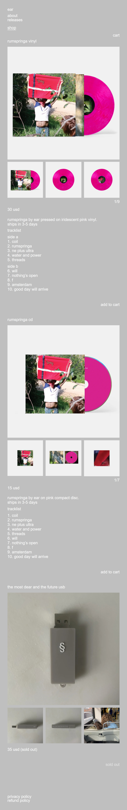
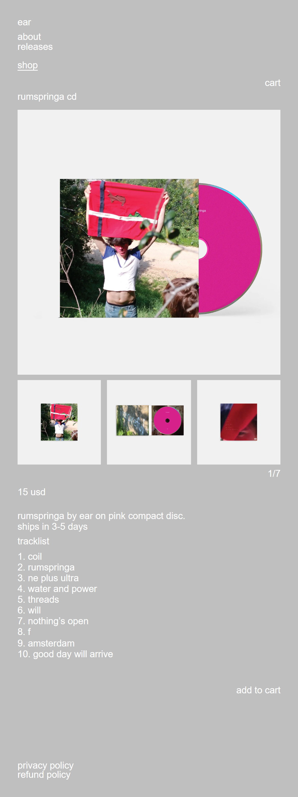
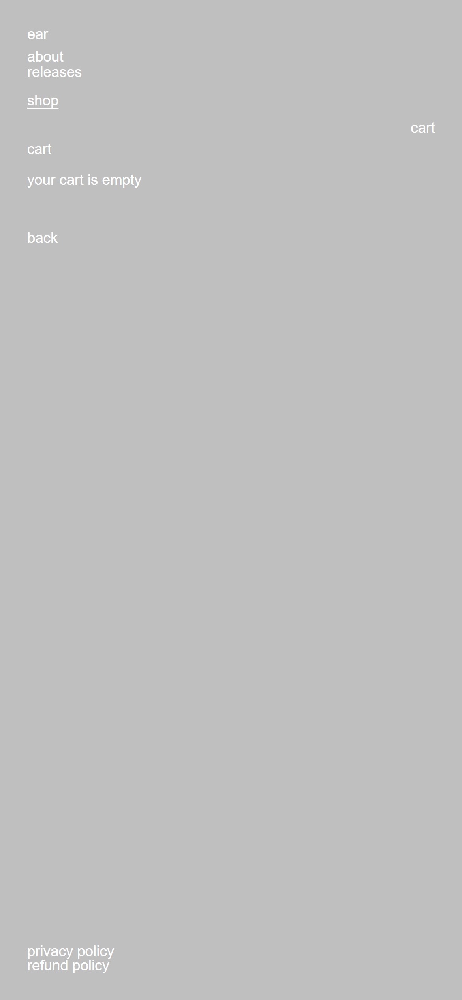

# B — shop.ear-music.org

**What it is.** ear's merch shop: three items (a vinyl, a CD, a sold-out USB) on a hand-built Shopify theme that shares A's visual language but none of its code.

**Who it's for.** Someone who came from A's nav already intending to buy, and needs the price, the tracklist and a button.

Captured 2026-09-22 · 390 × 844, dpr 3.

| page | URL | HTTP | scroll height |
|---|---|---:|---:|
| home | `https://shop.ear-music.org/` | **200** | 2478 |
| product | `https://shop.ear-music.org/products/rumspringa-cd` | **200** | 1038 |
| cart | `https://shop.ear-music.org/cart` | **200** | 844 |

**This is the most useful reference in the set.** It's the only one whose whole design system is exposed as CSS custom properties, so the rules can be read rather than inferred.

---

## Captures





---

## The token system, verbatim

From `scrape/shop.ear-music.org/css/ear.css`:

```css
:root {
  --ear-bg:        #bfbfbf;
  --ear-fg:        #ffffff;
  --ear-panel:     #f1f1f1;
  --ear-accent:    #ff0000;
  --ear-pad:       2.5rem;      /* 1.875rem at mobile */
  --ear-gutter:    0.65rem;
  --ear-line:      1;
  --ear-line-copy: 1.15;
}

html {
  --ear-root-scale: 0.0144;                                     /* desktop */
  font-size: clamp(11px, calc(min(100vw, 100vh) * var(--ear-root-scale)), 22px);
}
@media (max-width: 1024px) { html { --ear-root-scale: 0.0224;  } }
@media (max-width: 700px)  { html { --ear-root-scale: 0.03136; } }

.ear-page { padding: var(--ear-pad); min-height: 100svh;
            display: flex; flex-direction: column; align-items: flex-start; }
.ear-grid { display: grid; grid-template-columns: repeat(12, 1fr);
            column-gap: var(--ear-gutter); }
```

Five colours, two line-heights, two spacing values, one fluid root size. That is the entire system.

**The root scale keys off the shorter viewport axis**, not the width — so rotating a phone to landscape doesn't inflate the type. At 844 × 390 it clamps to 11px while A jumps to 15.72px off the long axis. It's the one genuinely clever line in the reference set.

`--ear-pad: 1.875rem` × 12.2304px = **22.932px**, which is where the gutter comes from.

---

## Layout

### `/products/rumspringa-cd`

```
390 ×1038
┌──────────────────────────────┐
│ ear                          │  22.9
│ about                        │
│ releases                     │
│                              │
│ shop                         │  ← underlined (current)
│                         cart │
│                              │
│ rumspringa cd                │  y 120.1   product title
│┌────────────────────────────┐│
││      ┌──────────┐          ││  .ear-hero  344.2²
││      │  object  │          ││  ground #f1f1f1
││      │  photo   │          ││  aspect-ratio 1/1
││      └──────────┘          ││  object modest inside it
│└────────────────────────────┘│
│┌────┐ ┌────┐ ┌────┐          │  3 thumbs 109.4² , gap 7.95
││    │ │    │ │    │          │  each on its own #f1f1f1
│└────┘ └────┘ └────┘          │
│                          1/7 │  text counter, right
│ 15 usd                       │  y 635.5
│ rumspringa by ear on pink    │  copy, lh 1.15
│ compact disc.                │
│ ships in 3-5 days            │
│ tracklist                    │
│ 1. coil                      │
│ …                            │
│                  add to cart │  y 926.5, RIGHT-aligned
│                              │
│ privacy policy               │  y 2431 (home) — footer
│ refund policy                │
└──────────────────────────────┘
```

**Composition.** Everything left-aligns to the same 22.9px gutter in a 344.2px column — *except two things*, which right-align: the image counter (`1/7`) and the buy control. That asymmetry is the only compositional gesture on the page and it's worth noticing.

**The object sits in a box, and sits modestly.** The hero is a 344.2px square of `#f1f1f1` — a panel a shade lighter than the page — and the product photograph floats inside it with clear air on all sides. The object is never cropped, never bled, and never fills its frame. Thumbnails repeat the same treatment at 109.4².

**Index equals detail.** `/products/rumspringa-cd` renders the identical `article.ear-product` markup as the card on `/`. There is no separate PDP layout — only the surrounding list changes. All three products appear on the home page fully expanded, each with image, thumbnails, price, full tracklist and a buy button. For a three-SKU shop that's the right call: no teaser grid, no click-through to learn the price.

**Vertical rhythm** (product page, measured):

```
title  → hero        11.2px
hero   → thumbs       7.9px   (= --ear-gutter)
thumbs → counter      6.1px
counter→ price       12.2px   (= 1rem)
price  → copy        17.1px
copy   → buy         34.3px
product→ product     33.1px
```

### `/cart`

844px tall, effectively empty — the cart is a right-hand **drawer** (`.ear-cart-panel`, `transform 0.2s`) that opens in place over the product page. `/cart` exists as a fallback route rather than a destination. Checkout is Shopify's own hosted page, reached from the drawer.

---

## Typography

Same stack as A, no webfont. Nine roles, **one size, one weight, one colour**.

| role | example | size | weight | line-height |
|---|---|---:|---:|---:|
| wordmark | `ear` | 12.2304px | 400 | 1.0 |
| nav | `about` `releases` `shop` `cart` | 12.2304px | 400 | 1.0 |
| product title | `rumspringa cd` | 12.2304px | 400 | 1.0 |
| price | `15 usd` | 12.2304px | 400 | 1.0 |
| buy label | `add to cart` | 12.2304px | 400 | 1.0 |
| counter | `1/7` | 12.2304px | 400 | 1.0 |
| body copy | `rumspringa by ear on pink compact disc.` | 12.2304px | 400 | **1.15** |
| list row | `the most dear and the future usb` | 12.2304px | 400 | 1.0 |
| footer | `privacy policy` | 12.2304px | 400 | 1.0 |

Unlike A, lowercase is enforced in CSS (`text-transform: lowercase`) on titles, price and button. Hierarchy comes entirely from **position**: nothing is bigger, bolder or a different colour than anything else.

---

## Colour

| role | declared | composited | area @390 |
|---|---|---|---:|
| page ground | `--ear-bg` | **#bfbfbf** | 1,223,396 px² |
| object panel | `--ear-panel` | **#f1f1f1** | 423,177 px² |
| photography ground | — | #000000 | 316,500 px² |
| all text | `--ear-fg` | **#ffffff** | 61,789 px² |
| focus ring | `--ear-fg`, 2px | #ffffff | 2 occurrences |
| accent | `--ear-accent` | **#ff0000** | used on `a.ear-active` only |

`<meta name="theme-color" content="#bfbfbf">` — the browser chrome matches the page.

**Five colours, and the accent is nearly invisible in practice.** `#ff0000` is declared and spent on exactly one selector: the current nav item. It is not used for price, buy, sale or error. White-on-grey measures **1.84:1**, same failure as A.

---

## Product presentation

| | |
|---|---|
| image size | 344.2 × 344.2 = **88.3% of viewport width** |
| aspect handling | frame is `aspect-ratio: 1/1`, image `object-fit: cover` |
| background behind object | **a box** — `#f1f1f1` panel, one shade off the page |
| edge margin | 22.932px, same gutter as text — **never full-bleed** |
| multi-view | **click-to-swap thumbnails** |
| indicator | **text counter** `1/7`, body size, right-aligned |
| price placement | left, above the copy |
| buy placement | **right-aligned**, below everything |

**The gallery cannot be swiped.** `.ear-hero` is `overflow: hidden`, every ancestor reports `scroll-snap-type: none`, and there are **zero** scroll-snap, `touch-action` or `overscroll-behavior` rules in the whole stylesheet. The thumbnails are real `<button aria-label="show image N">` elements that swap the hero on click. On a phone you must hit a thumbnail.

**Only three thumbnails are shown** — for products with 9, 7 and 4 images alike. The row doesn't scroll and doesn't paginate, so images 4–9 of the vinyl are reachable only by cycling.

### Buy control, in every state I could trigger

| state | appearance |
|---|---|
| default | `add to cart` — **no fill, no border, no padding, no radius** |
| hover | **no change** (there is not one `:hover` rule in the theme) |
| press | `opacity: 1 → 0.7` |
| focus-visible | `outline: 1px solid #ffffff`, offset 2px |
| sold out | price becomes `35 usd (sold out)`, label becomes `sold out` — same styling, no strikethrough, no badge, no dimming |

Measured box: **57.8 × 12.2px**, right-aligned to the content edge. It is two words of body text in the corner, visually indistinguishable from the rest of the page until you tap it. Its only affordance is position.

### Image delivery — the one thing B gets right

```
srcset  …&width=600    600w,
        …&width=900    900w,
        …&width=1400  1400w
sizes   (max-width: 800px) 92vw, 33vw
```

| dpr | selected | verified at CDN | vs 344.2px slot |
|---:|---|---|---:|
| 1 | `width=600` | 600 × 600, 48 KB | 1.74× |
| 3 | `width=1400` | 1400 × 1400, 174 KB | **4.07×** |

Correctly retina. One nit: `sizes` claims `92vw` against a true 88.3vw slot, a ~4% over-fetch.

*(Caution for anyone re-measuring: `naturalWidth` reports `358` at **both** densities, because for `w`-descriptor srcsets it returns the density-corrected CSS size, which always equals the resolved `sizes` value. Read `currentSrc` and fetch it.)*

---

## Motion and interaction

```
hover          NONE — not one :hover rule in the entire theme
:active        opacity 0.7          (links and buttons alike)
focus-visible  outline 1px solid #ffffff, offset 2px
cart backdrop  opacity 0.15s
cart panel     transform 0.2s
image swap     none — the hero changes instantly, no cross-fade
page load      none
```

`@media (prefers-reduced-motion: reduce)` **is** honoured — the drawer and backdrop drop to `transition: none`. B is the only one of the three references that bothers.

Zero scroll-snap containers, zero sticky or fixed elements, `scroll-behavior: auto`.

**Zero hover states is the headline.** This is a touch-first design that simply declines to have a desktop interaction layer.

---

## Copy voice

Lowercase, enforced in CSS. No terminal punctuation on labels; product prose keeps its full stops.

```
ear   about   releases   shop   cart
rumspringa cd            15 usd            1/7
rumspringa by ear on pink compact disc.
ships in 3-5 days
tracklist       1. coil       2. rumspringa
add to cart     sold out      35 usd (sold out)
privacy policy  refund policy
```

Price format is `15 usd` — **no symbol, no cents, no emphasis**, lowercase currency. Shipping time lives inline in the product description, not on a policy page. Sold-out is a parenthetical, not a badge. The footer is two links and nothing else: no contact, no social, no newsletter, no shipping page.

---

## What to take for sie

Take the token block nearly whole — five colours, `--line: 1` / `--line-copy: 1.15`, `--pad` and `--gutter` — and take `clamp(11px, min(100vw,100vh) × scale, 22px)` for the root size, because keying off the short axis is right and almost nobody does it. Take **index-equals-detail** (with one product there is no reason for a teaser), the **object-in-a-panel** treatment where the product sits modestly inside a box a shade off the page, the **plain-text counter** as indicator, `min-height: 100svh`, `text-size-adjust: 100%`, the srcset shape (600/900/1400 against a `sizes` hint), lowercase enforced in CSS, and the price format `$80` over anything fancier. Take zero hover and `opacity .7` on press.

**What not to take:** the buy control — 57.8 × 12.2px of unstyled text is 28% of the minimum touch target and the single most important element on the page; it needs a real 44px hit area and something that reads as a control. Don't take white-on-grey (1.84:1). Don't take click-to-swap with three thumbnails for nine images — it buries most of the gallery, and Naim wants swipe. Don't copy `sizes: 92vw` (wrong by 4%; full-bleed makes `100vw` exact). And don't inherit the 114-request page weight — that's Shopify's tax, not a design choice, but it's worth knowing the reference costs 1,017 KB and 4.7s to LCP under Slow 4G.
