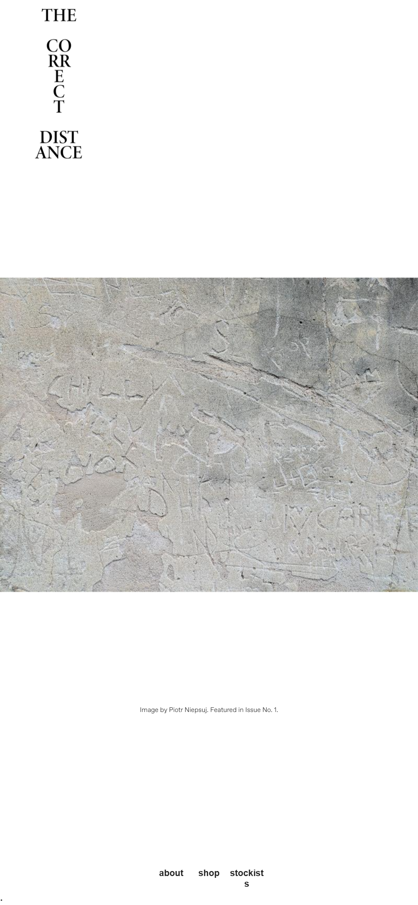
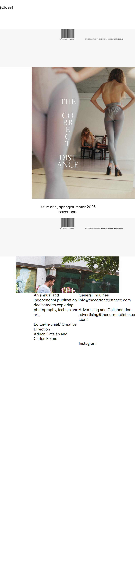
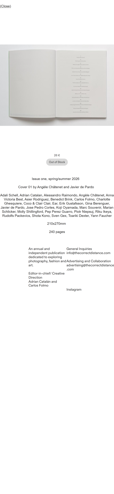

# C — thecorrectdistance.com

**What it is.** The site for *The Correct Distance*, an annual independent photography, fashion and art publication edited by Adrian Catalán and Carlos Folmo — one issue, sold in four cover variants, on Cargo with Cargo Commerce.

**Who it's for.** Someone deciding whether a 240-page art book is worth €26, who wants to see inside it before committing.

Captured 2026-09-22 · 390 × 844, dpr 3.

| page | URL | HTTP | scroll height |
|---|---|---:|---:|
| home | `https://thecorrectdistance.com/` | **200** | 1688 |
| shop | `https://thecorrectdistance.com/shop` | **200** | 1688 |
| product | `https://thecorrectdistance.com/shop-cover-01` | **200** | 1688 |

---

## Captures





---

## Layout

### `/shop-cover-01` — the product page

```
390 ×1688
┌──────────────────────────────┐
│ (Close)                      │  y 13.9, full-width tap strip
│                              │
│                              │
│                              │  ← ~70px of nothing
│┌────────────────────────────┐│
││                            ││  gallery frame 390 × 415
││   [photo of the book,      ││  9 slides stacked here
││    open, on a light        ││  cover pillarboxed to 331.9
││    surface]                ││  spreads letterboxed, full width
│└────────────────────────────┘│
│                              │
│                              │  ← ~95px of nothing
│            26 €              │  CENTRED
│         ( Out of Stock )     │  CENTRED pill, 74.7 × 23.9
│                              │
│   Issue one, spring/summer   │  CENTRED
│            2026              │
│  Cover 01 by Angèle Châtenet │  CENTRED
│      and Javier de Pardo     │
│                              │
│ Adali Schell, Adrian Catalan,│  CENTRED, justified-feeling
│ Alessandro Raimondo, Angèle  │  contributor list — ~40 names
│ Châtenet, Anna Victoria Best,│  running full column width
│ …                            │
│                              │
│         210x270mm            │  CENTRED
│         240 pages            │  CENTRED
│                              │
│  An annual and  General      │  TWO COLUMNS
│  independent    Inquiries    │  left: about
│  publication…   info@…       │  right: contact
│  Editor-in-chief/            │
│  Creative Direction          │
│  Adrian Catalán  Instagram   │
│  and Carlos Folmo            │
└──────────────────────────────┘
```

**Composition — and this is where C differs fundamentally from A and B: it is centred.** The price, the buy control, the issue line, the cover credit, the contributor list, the dimensions and the page count are all centre-aligned in the column. Only the closing about/contact block breaks into two left-aligned columns.

**Air is the main material.** Roughly 70px above the object and 95px below it before the price appears. The page is 1688px tall for what is, in content terms, a photograph, a price, a button and four short lines. A and B pack; C spaces.

**The object floats, it does not sit in a box.** There is no panel behind it — the photograph itself contains the surface the book rests on, and the page ground shows through wherever the image doesn't reach. That's the opposite of B's `#f1f1f1` panel.

**Nav is not at the top.** There is no header bar at all. The logo sits in the top-left corner as a 110.4 × 156 image, and the actual nav — `about` / `shop` / `stockists` — lives **mid-page at y ≈ 811**, inline and horizontally grouped. You scroll past the hero to reach the navigation.

`/shop` is not a page in the normal sense: it's a **scrollable overlay opened over the homepage**, with a full-width `(Close)` strip at the top. The URL changes; the homepage stays underneath.

---

## Typography

The only reference of the three that loads webfonts — three files, 1,181 KB, all ABC Dinamo via `type.cargo.site`. See `fonts.md`.

| role | family | size @390 | weight | line-height |
|---|---|---:|---:|---:|
| nav / links | **Diatype Variable** | 11.6189px | 400 | 1.2 |
| body / contributor list | **Arizona Text Variable** | ~8.3px | 400 | 1.2 |
| caption | **Favorit Variable** | **6.2244px** | 300 | 1.2 |
| price, buy label | **Diatype Variable** | 9.959px | 400 | normal |

Root is `2.128vw` → **8.2992px at 390**, which is **32% smaller than the ear sites** at every viewport. Four sizes, two weights, three families — against ear's one and one.

A **6.2px caption** is below any reasonable legibility floor on a phone. Example copy: `Image by Piotr Niepsuj. Featured in Issue No. 1.` This is type used as texture beside photography, not as something anyone is expected to read.

---

## Colour

| role | value | composited |
|---|---|---|
| page ground | `#ffffff` | **#ffffff** |
| all text | `#000000` | **#000000** |
| buy fill | `rgba(0,0,0,0.15)` | **≈#d9d9d9** on white |
| buy label | `rgba(0,0,0,0.75)` | ≈#404040 |
| dividers | — | **none** |
| accent | — | **none** |

**Two colours plus photography.** No accent, no grey scale, no tint, no `theme-color` meta. Black on white is 21:1 — the only reference that comfortably passes AA, and it does so by not trying anything.

---

## Product presentation

| | |
|---|---|
| frame | 390 × 415, **0.94:1** — near-square |
| image size | **100% of viewport width** — full-bleed, zero side margin |
| background behind object | **none** — the page ground, no panel |
| aspect handling | **fitted whole, never cropped** |
| multi-view | **stacked slideshow**, 9 slides |
| indicator | **none at all** |
| price | centred, above the button, **with currency symbol** (`26 €`) |
| buy | centred, directly below the price |

All nine slides report the identical host rect `[0, 83.6, 390, 415]` — they are absolutely stacked, not laid side by side. Inside that constant frame each slide is fitted at its own aspect:

| slide | rendered | treatment |
|---|---|---|
| cover (portrait) | 331.9 × 414.9 at x 29.1 | **pillarboxed**, 29.1px each side |
| spreads (landscape) | 390 × 278.6 or 292.5 | **letterboxed**, 61–68px top and bottom |

Nothing is normalised to a common ratio. The frame stays constant and the artwork floats inside it — you see each image whole. On the `/shop` index the four covers run **corner to corner at zero margin**, 390 × 488.

**Navigation is invisible.** Prev/next are full-height hit zones at the frame edges:

```css
::part(slideshow-nav-previous-button) { position:absolute; top:0; left:0;  bottom:0 }
::part(slideshow-nav-next-button)     { position:absolute; top:0; right:0; bottom:0 }
::part(slideshow-nav) { transition: opacity 222ms ease-in-out }
```

with 36 × 36 arrow glyphs centred vertically. The only visible affordance is that **hovering the frame changes the cursor to `e-resize`** — the single most useful hover state in the reference set, because it announces horizontal navigation before you touch anything.

**There is no indicator of any kind** — no dots, no counter, no progress bar. Nothing tells you nine slides exist.

### The buy control — and a correction worth reading

The observed state is `Out of Stock`: a 74.7 × 23.9 pill, `rgba(0,0,0,0.15)` fill, `border-radius: 10em`, `padding: 0.5em 1em`, no border, centred.

I previously recorded this as the *disabled* state and said the enabled appearance couldn't be observed because the product is sold out. **That was wrong.** Removing `.out-of-stock` at runtime and probing `.add-to-cart`, `.in-stock` and `.available` all produce an **identical** computed style:

```
out-of-stock   bg rgba(0,0,0,0.15)  color rgba(0,0,0,0.75)  radius 99.5904px
(no class)     identical
add-to-cart    identical
in-stock       identical
available      identical
```

And it isn't the site's styling at all. `shop-product::part(button)` in the page CSS sets only `line-height`, `cursor`, `display` and a row of `inherit`s — **no background, no radius, no padding**. The shadow root holds 273 bytes covering `:host` and `.container`. The pill is **Cargo Commerce's built-in component default**, shipped from the CORS-blocked framework CSS at `build.cargo.site`, which is why it never appeared in a rule scan.

**So there is no enabled rule to copy. It doesn't exist.** The grey pill is a platform artefact, not a decision anyone made.

### Image delivery

| | dpr 1 | dpr 3 | vs 390px slot |
|---|---|---|---:|
| spreads | `/w/400/` 400 × 300, 51 KB | `/w/800/q/75/` 800 × 600 | **2.05×** |
| cover | `/w/350/` 350 × 438 | `/w/700/q/75/` 700 × 875 | 2.11× |

Cargo caps at 800w and drops quality to 75. `object-fit: fill` (not `cover`) — safe here only because every source is exactly 4:5. **Don't copy that rule**; it distorts the moment a source differs.

---

## Motion and interaction

```
gallery frame hover   cursor: auto → e-resize      ← the one real hover state
nav / buy hover       no change
press, anything       opacity → 0.7
slideshow nav fade    opacity 222ms ease-in-out
link transitions      none
overlay               position:fixed; inset:0; max-height:100dvh;
                      overflow:auto; overscroll-behavior:none
page transition       Cargo View Transitions, opacity 120/160ms
```

`prefers-reduced-motion` is **not** honoured. Zero scroll-snap containers. The `overscroll-behavior: none` on the overlay is worth copying for any modal — it stops the page underneath scroll-chaining.

---

## Copy voice

**Sentence case with real punctuation** — the opposite of both ear sites.

```
(Close)                      about   shop   stockists
26 €                         Out of Stock
Issue one, spring/summer 2026
Cover 01 by Angèle Châtenet and Javier de Pardo
210x270mm                    240 pages
An annual and independent publication dedicated to exploring
photography, fashion and art.
Editor-in-chief/ Creative Direction
Adrian Catalán and Carlos Folmo
General Inquiries  info@thecorrectdistance.com
Advertising and Collaboration  advertising@thecorrectdistance.com
```

Capitalised, accented properly (`Angèle`, `Catalán`), full stops present. Dimensions written `210x270mm` with a literal `x`. Contact is raw email addresses as text, not a form. **No shipping page exists anywhere** — not in nav, not in footer, not on the product page. Nor do policies, terms or returns.

---

## What to take for sie

Take the **spatial confidence**: far more air around the object than feels comfortable, and a page that is mostly empty. Take the **fixed frame with the artwork fitted whole** — pillarboxed when portrait, letterboxed when landscape, never cropped — which is exactly the right answer for Naim's four views spanning 1.0 to 1.55 aspect. Take **full-bleed imagery at zero side margin**, the `e-resize` cursor as a swipe affordance, `overscroll-behavior: none` on any overlay, and the habit of stating physical facts plainly (`210x270mm`, `240 pages`) — a CD has equivalents worth naming.

**What not to take:** the centring (sie's other two references are left-aligned and mixing the two reads as indecision — pick one), the 6.2px caption, `object-fit: fill`, the **missing indicator** (nine slides with no sign they exist is a genuine usability failure, and B's plain `1/9` fixes it for one line of text), the 1,181 KB of webfonts and the CLS 0.17 they cause, and the grey pill — which, as above, isn't a design decision to inherit. Also don't copy the mid-page nav; it's a strong idea on a site with three routes and a hero that earns the scroll, and it would simply hide the nav on sie.
